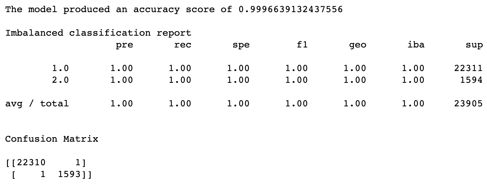
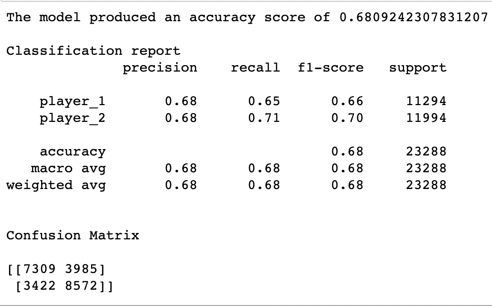
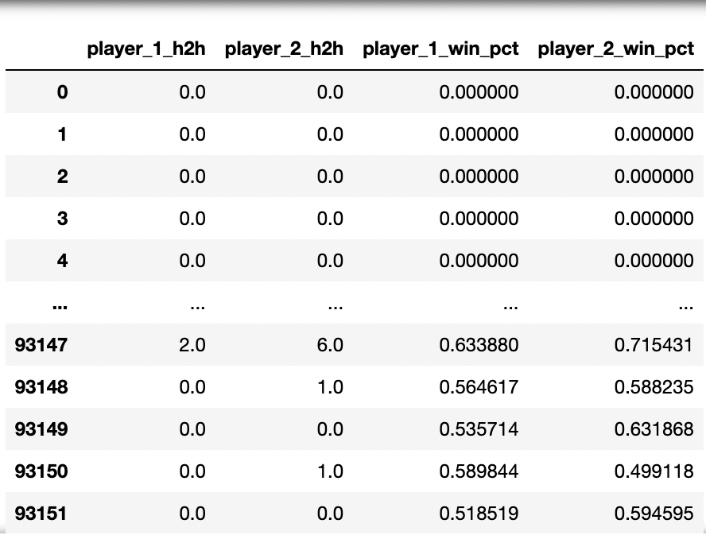
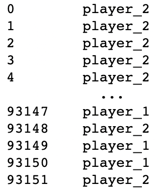
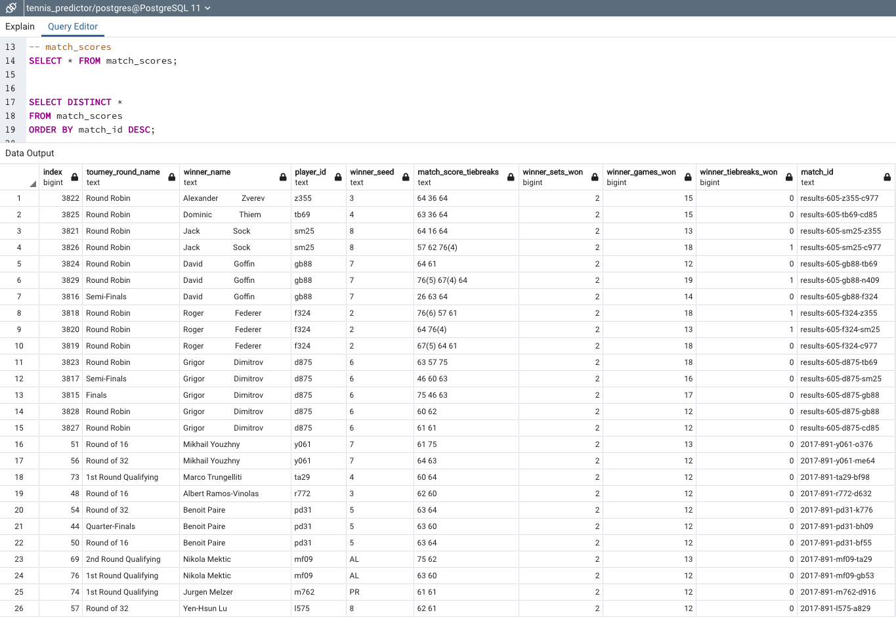
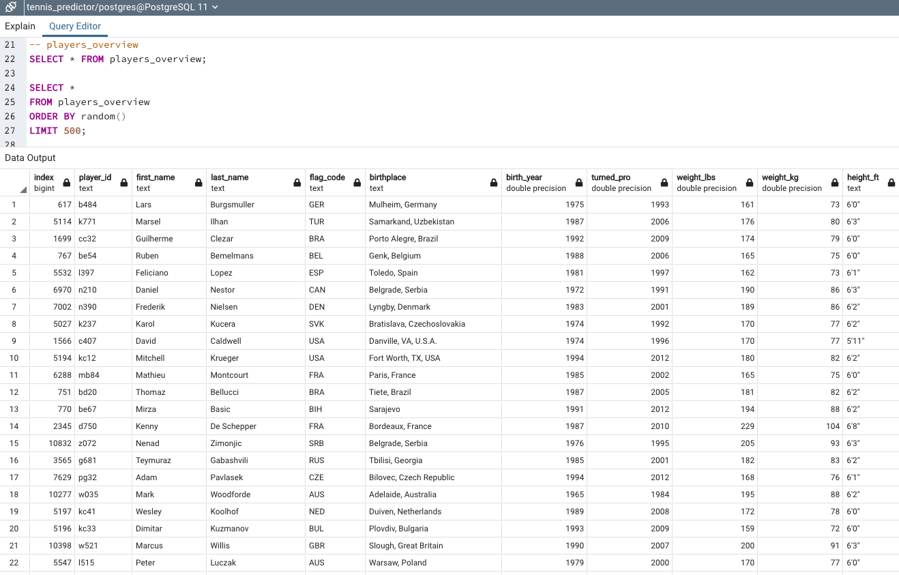
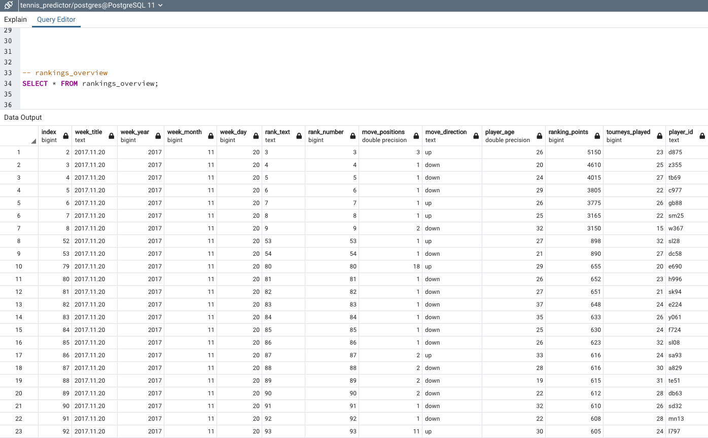
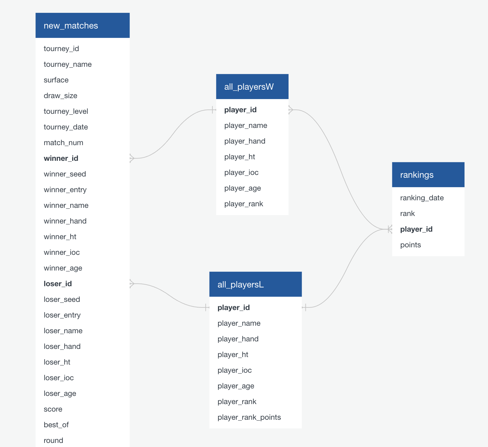
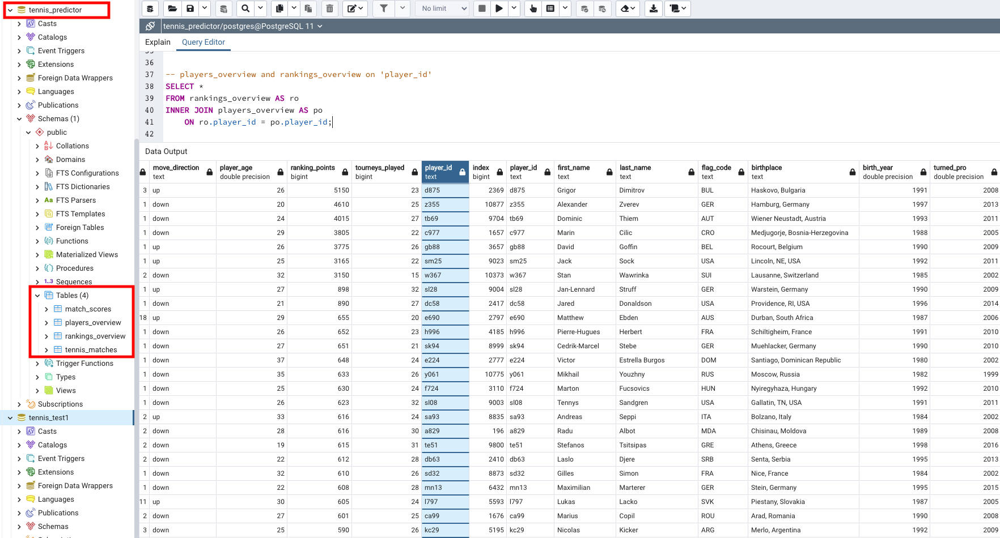

# Tennis Predictor

## Table of Contents:
1. Presentation
    - [Overview](##Overview:)
    - [Technologies Used](#Technologies:)
    - [Dataset](#Dataset:)
2. GitHub
    - Repository
3. Machine Learning Model
    - [Logistic Regression](#machine-learning-model:)
4. Database
    - [Database Storage](#Database-Storage:)

## Overview:
The purpose of this project is to create a machine learning model to accurately predicts the winner of a match on the Association of Tennis Professionals (ATP) Tour.

- Selected topic: 
Tennis 

- Reason why we selected this topic:
    - Tennis is a global sport and we are giving an overall score of the players and predict who will win a match versus one another. We are also creating a website to interact with the audience to compare and contrast which player will win hypothetically. The dataset included players’ name, birth year, left handed or right handed, winning sets via first serve, etc. The statistical model that represents this data is logistic regression model because after combining all of players' stat, we want to predict who will win against one another purely on data. The datatypes include objects, floats, and integers.

- Questions to answer with the data:
1. Which country has the most winners?

2. Which hand (left or right handed) has the highest winning percentage?

3. Does tennis court surface impact players’ performance?

4. How influential are break points on match outcome?

## Technologies:
- Programming Language: `Python`

- Machine Learning Model: `Logistic Regression - Binary Classification, Scikit-Learn`

- Relational Database: `postgreSQL` 

- Object Relational Mapper: `SQLAlchemy`

- Visualization: `Tableau`

## Dataset:

The dataset [ATP World Tour tennis data](https://datahub.io/sports-data/atp-world-tour-tennis-data#resource-match_stats_2017_unindexed) was obtained from [DataHub.io](https://datahub.io) and it contains tournaments information such as match scores, match stats, rankings and players overview.

## Machine Learning Model:

We are still using a logistic regression model for binary classification. We want to be able to predict the correct player winning when provided two different players along with their characterstics, match stats of current match, and career performance. Our previous model was prone to data leakage, which made us revisit data cleaning, data transformation, and feature engineering. Our latest model is able to correctly predict the right player winning 68% of the time, when given each players' win percentage prior to the match and head-to-head record (previous meetings). Currently, we are in the process of engineering more features to supply the model with. More specifically, we want to create features based on break points, first serves, and tournament surface. We believe once we have these missing features our model will be more accurate and inclusive.

Previous model results:

Current model results: 

Current model features:

Current model target:

## Database Storage:

After cleaning the DataFrames with Python, we made a connection to `postgreSQL` using `SQLAlchemy`. Below are the tables loaded into `postgreSQL`, the ERD, and a joined table. 

1) match_scores table

2) players_overview table

3) rankings_overview table

4) ERD

5) Inner Join: `players_overview` and `rankings_overview` on `player_id`

## Team Members:
- Theodoric Tran
- Julieta Hernandez
- John Lee
- Leanna Renteria

## Communication Protocols
- ZOOM
- Slack
