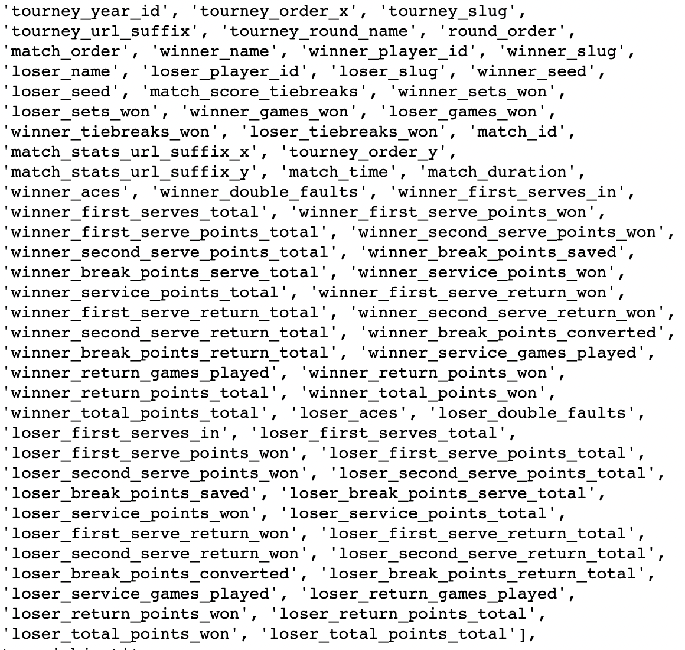
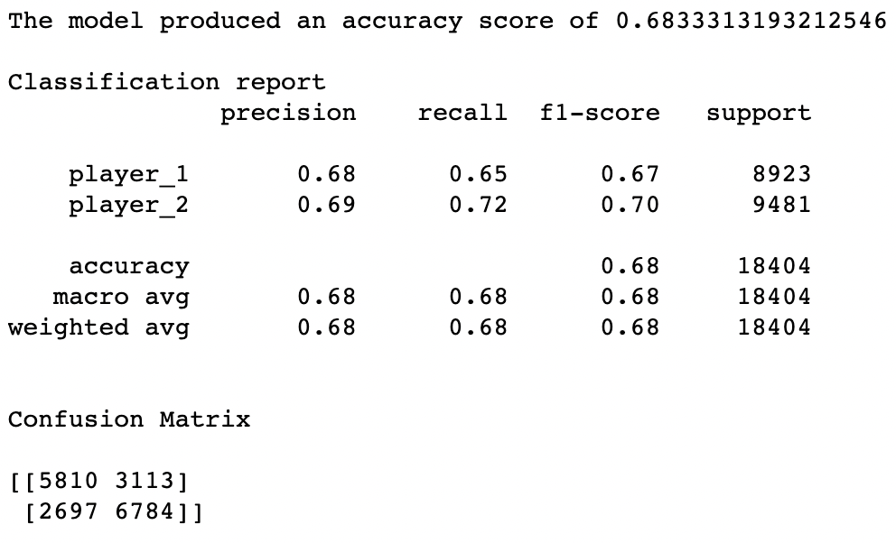
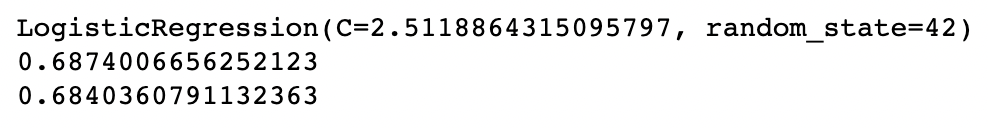
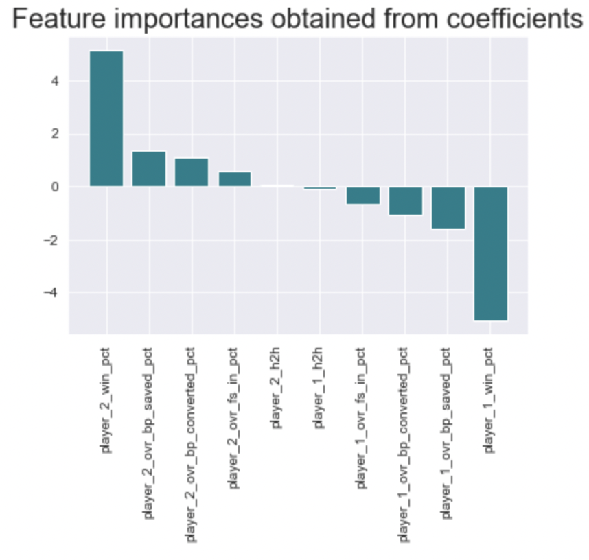
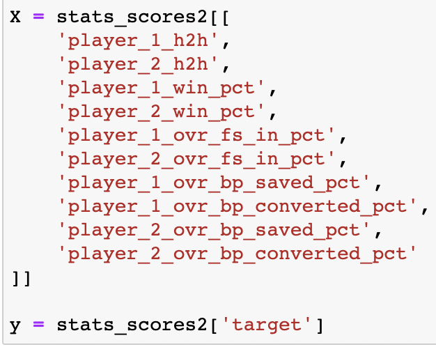
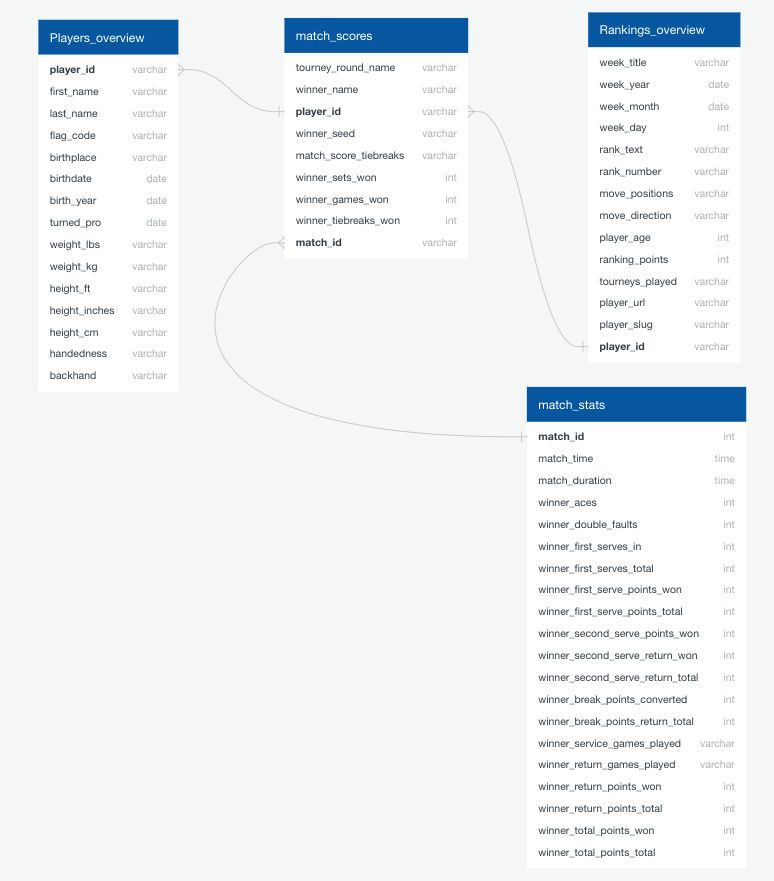

# Tennis Predictor

## Table of Contents:
1. Presentation
    - [Overview](##Overview:)
    - [Technologies Used](#Technologies:)
    - [Dataset](#Dataset:)
2. GitHub
    - Repository
3. Machine Learning Model
    - [Logistic Regression](#machine-learning-model:)
4. Database
    - [Database Storage](#Database-Storage:)

Link to presentation: https://docs.google.com/presentation/d/1Ls3NwU10uxvZovScrWnc-1DtVh1fgiCA2dgChteHuOM/edit?usp=sharing

## Overview:
The purpose of this project is to build a machine learning model in order to accurately predict the outcome of tennis matches.

- Selected topic: 
Tennis 

- Reason why we selected this topic:
    - Tennis is a global sport and we wanted to create a dataset that over sees all tennis players’ stats from 1991-2016. We are giving an overall score of the players and predict who will win a match versus one another. We are also creating a website to interact with the audience to compare and contrast which player will win hypothetically. The dataset included players’ name, birth year, left handed or right handed, winning sets via first serve, etc. The statistical model that represents this data is logistic regression model because after combining all of players' stat, we want to predict who will win against one another purely on data. The datatypes include objects, floats, and integers.

- Questions to answer with the data:
1. Do country of origin matter greatly for all players? Some countries are heavily influenced by Tennis (ex. England, Australia, France, US, Switzerland, etc.) and the country offers more opportunities for athletes interested in the sports.
2. Which hand (left or right handed) has the highest winning percentage? When a player swings the racket, the ball gets effected like speed, spin rate, angle of the ball getting hit, and more. If the same right-handed players play, they could easily predict where the ball trajects. However, when a right-handed player faces a left-handed player, all of the features of the ball getting hit might be different, even slightly advantageous. 
3. What is the average career span of a tennis player? During the years we researched, some players could have retired or could have begun their career or in the middle of their prime.
4. What’s the long-term forecast? Through looking and analyzing the organized data, we can make assumptions that this player is predicted win the tournament or will be ranked at the end of the season or for the next season.
5. Do break point matter? Break point means that the service receiving player will win the game over the player who is doing service shot. This is a momentum shift for the service receiving player because he/she will be servicing next and greatly impact sport psychology. We can observe the break point converted numbers or break point made to see if the particular have some advantage in the situation.

## Technologies:
- Programming Language: `Python` 

- Relational Database: `postgreSQL` 

- Object Relational Mapper: `SQLAlchemy`

- Visualization: `Tableau`, `JavaScript`, `D3.js`, `HTML` 

## Dataset:

The dataset [ATP World Tour tennis data](https://datahub.io/sports-data/atp-world-tour-tennis-data#resource-match_stats_2017_unindexed) was obtained from [DataHub.io](https://datahub.io) and it contains tournaments information such as match scores, match stats, rankings and players overview.

## Machine Learning Model:

Data Preprocessing:
- After merging datasets related to stats and scores, we have a dataframe containing all matches played from 1991 to 2017 that include information about who won, each player's performance, and score. We have 95,773 matches and 76 columns of information to use. We were missing information on dates of the matches. To fill in the dates, we took a dataset containing tournament information (i.e. date tournament took place, tournament name), changed tournament_date to datetime data type and merged it to our stats_scores dataframe containing all the matches and stats. Looking at the columns available and questions we wanted to answer, we were interested in specific point categories for each player. 
- Columns: 

Feature Engineering and Feature Selection:
- To predict the winner without the data being tied to the known winner or loser, a function was created to replace 'winner_' and 'loser_' with 'player_1' and 'player_2' while 'player_1' was assigned to whoever alphabetically came first. We took all their attributes and stats as well.
- We engineered a number of features: 
    - Players' head-to-head wins against each other prior to match
    - Players' overall win percentage prior to match
    - Players' overall first serve in percentage prior to match
    - Players' overall break point saved percentage prior to match
    - Players' overall break point converted percentage prior to match
- For performance categories, we were particularlly interested in seeing how first serve percentages, break points saved percentages, and break points converted percentages influenced the outcome of a match because one break of serve is needed in a set to win the set while it is assumed that all players should maintain their serve (not be broken). 
- Break points can be thought of as pressure points. High break points saved percentages can indicate how well a server performs while under pressure as high break points converted percentages can indicate how well the returner applies pressure to the server.
- The target column would be either Player 1 or Player 2 indicating which player won.

Model Choice:
- We are trying to predict in a given match who would win player_1 or player_2 which falls under a classification problem. To do so, we have chosen a logistic regression model because it fit our needs and it was easy to implement and interpret. A drawback of the logistic regression model is that it can over-fit the training set. 
- With nearly 96,000 matches covering 1991 to 2017, the data was split 70/30. 70% of the data becaming the training set while the remaining 30% became the testing set.
- Since our previous model, we added additional features and did not change the model. We ran the model using Grid Search to find the optimal parameters. We found players' win percentages were the most influential, followed by break points saved percentages. Players' head-to-head records were the least influential on match outcome.
- Our current model f1-score is 68% meaning it can predict the correct winner nearly 7 times out of 10 which is better than 50/50 odds. From our previous model to our current model, the addition of new features did yield any signficant improvements over the prior model, yet the latest model factors in performance categories that we were interested in. Our current model tells that break points do matter, but not nearly as much as win percentages do.

Current Accuracy Score:

Grid Search Results:

Feature Importances

The features used and the target column: 

Previous model results: 

Previous model features:

Previous model target:

Initial model results:

## Database Storage:

After cleaning the DataFrames with Python, we made a connection to `postgreSQL` using `SQLAlchemy`. Below are the tables loaded into `postgreSQL`, the ERD, and a joined table. 

1) match_scores table

2) players_overview table

3) rankings_overview table

4) ERD

5) Inner Join: `players_overview` and `rankings_overview` on `player_id`

## Team Members:
- Theodoric Tran
- Julieta Hernandez
- John Lee
- Leanna Renteria